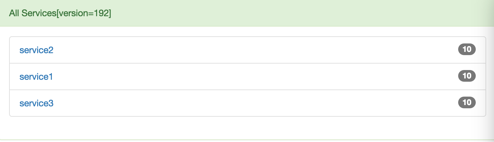
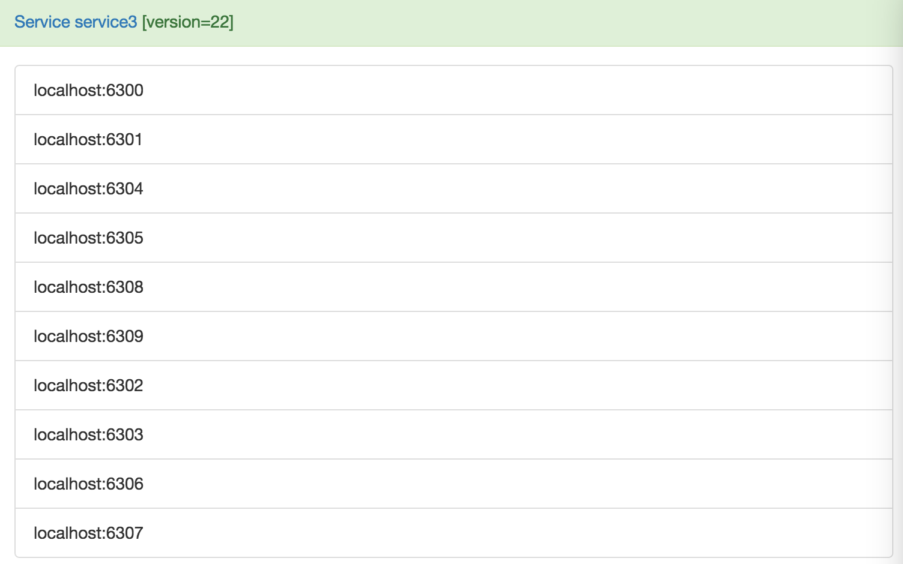

Captain
-------------
Captain is yet another service discovery implementation based on redis.
Captain sacrifices a little high availability for simplicity and performance.
In most companies, we dont have so many machines as google, amazon, alibaba etc.
The possibility of machine crashing is very low, high Availability is not so abviously important yet.
But the market only provides zookeeper/etcd/consul, they are complex, at least much complexer compared with captain.

Architecture
-------------


1. If all captain server or redis shutdown, captain client will keep services information in local memory.
2. If just one captain server shutdown, captain client will sync service information from other captain server.
3. Carefully monitor captain server and redis, recovery quickly, high availability still can be guaranteed.

Install Captain Server
---------------------
```
install redis
install java8
install maven

git clone github.com/pyloque/captain.git
cd captain
mvn package
java -jar target/captain.jar
java -jar target/captain.jar 6789  # http bind port
java -jar target/captain.jar 6789 localhost 6379 # specify redis url

open web ui
http://localhost:6789
```

Web UI
------------------------



Use Captain Python Client
---------------------------
```
git clone github.com/pyloque/pycaptain.git

from pycaptain import CaptainClient, ServiceItem, IServiceObserver


class ServiceCallback(IServiceObserver):

    def ready(self, name):
        print name, "is ready"

    def all_ready(self):
        print "service4 is all ready"

    def offline(self, name):
        print name, "is offline"


client = CaptainClient.origin("localhost", 6789)
(client.watch("service1", "service2", "service3")
    .provide("service4", ServiceItem("localhost", 6400))
    .observe(ServiceCallback())
    .stop_on_exit()
    .start())
client.hang() # hang just for test

```

Use Captain Java Client
-----------------------
```
git clone github.com/pyloque/captain-java.git

import captain.CaptainClient

public class Service4 {

    public static void main(String[] args) throws Exception {
        CaptainClient client = new CaptainClient("localhost", 6789);
        client.watch("service1", "service2", "service3")
        .provide("service4", new ServiceItem("localhost", 6000))
        .observe(new IServiceObserver() {

            @Override
            public void ready(String name) {
                System.out.println("ready:" + name);
            }

            @Override
            public void allReady() {
                System.out.println("service4 is ready");
                System.out.println("service1:" + client.select("service1").urlRoot());
                System.out.println("service2:" + client.select("service2").urlRoot());
                System.out.println("service3:" + client.select("service3").urlRoot());
            }

            @Override
            public void offline(String name) {
                System.out.println("offline:" + name);
            }

        }).stopBeforeExit().start();
        client.hang();
    }
}

```
