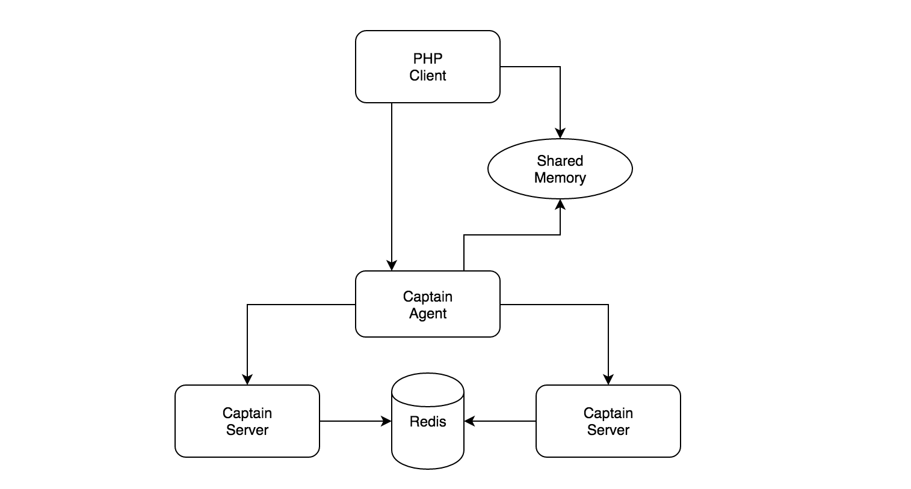

Captain -- Simplest service discovery in the universe
-------------
Captain is yet another service discovery implementation based on redis.
Captain sacrifices a little high availability for simplicity and performance.
In most cases, we don't have tens of thousands of machines, the possibility of machine crashing is very low, high availability is not so abviously important.
But the market only provides zookeeper/etcd/consul, they are complex, at least much complexer compared with captain.

Why Agent
-------------
Php has no stabilized multithread support. So agent is provided to communite with php client using memory mapped file.

Architecture
------------


Usage
-------------
```bash
install redis
install java8
install maven

git clone github.com/pyloque/captain-java.git
git clone github.com/pyloque/captain-agent.git

cd captain-java
mvn package
mvn install

cd captain-agent
mvn package
java -jar target/captain-agent.jar
java -jar target/captain-agent.jar ${configfile}  # custom config file
```

Configuration
---------------------------------------
Default Config File is ${user.home}/.captain/captain.agent.ini
```ini
[bind]
port=6790

[server]
origins=localhost:6789

[watch]
interval=1000
keepalive=5
```

API
-----------------------------------------
1. watch service /api/service/watch?name=service1&name=service2
2. watch kv /api/kv/watch?key=key1&key=key2
3. get service /api/service/get?name=service1
4. get kv /api/kv/get?key=key1

Notice
----------------------------------------
Agent will not support service registration.
